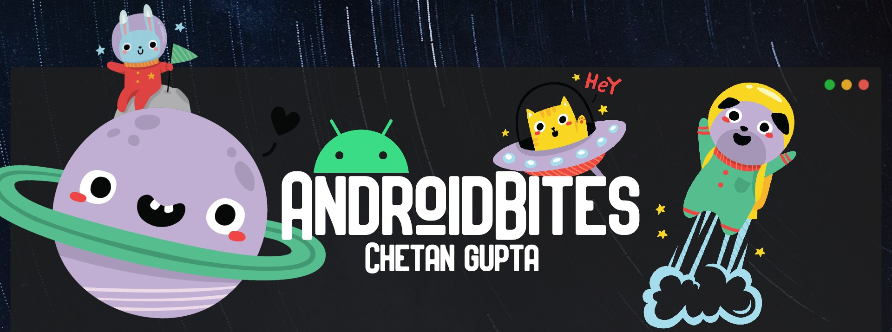

<h1 align="center"><a href="https://chetangupta.net/" target="_blank">AndroidBites</a>
</h1>

## :hand: About
Hola Amigos! 🙌, welcome to my coding playground!👩‍💻, do follow me on [`Twitter`](https://bit.ly/ch8n-twitter)

Do let me know if you find something useful or want to suggest some improvement
also don't forget to checkout of blogs at [`chetangupta.net|AndroidBites|Big-Brain-Kotlin`](https://chetangupta.net/)

## :eyes: Social
[LinkedIn](https://bit.ly/ch8n-linkdIn) |
[Medium](https://bit.ly/ch8n-medium-blog) |
[Twitter](https://bit.ly/ch8n-twitter) |
[StackOverflow](https://bit.ly/ch8n-stackOflow) |
[CodeWars](https://bit.ly/ch8n-codewar) |
[Portfolio](https://bit.ly/ch8n-home) |
[Github](https://bit.ly/ch8n-git) |
[Instagram](https://bit.ly/ch8n-insta) |
[Youtube](https://bit.ly/ch8n-youtube)

# Expanding Cards Compose
Sample of Cards which on click expands and collapse Horizontally

# Preview

# Compose API Used
* [Card](https://compose.academy/material/card)
* [Row](https://compose.academy/layout/row)
* [Text](https://compose.academy/material/text)
* [Image](https://foso.github.io/Jetpack-Compose-Playground/foundation/image/)
* Image Loading : using (`Picasso`)[https://square.github.io/picasso/], code inspiration from (CodingWithMitch)[https://www.youtube.com/watch?v=ktOWiLx83bQ&ab_channel=CodingWithMitch]

# TODO
* Test Cases
* Animations for expansion of cards and text visibility

## :cop: License
Shield: [![CC BY-SA 4.0][cc-by-sa-shield]][cc-by-sa]

This work is licensed under a
[Creative Commons Attribution-ShareAlike 4.0 International License][cc-by-sa].

[![CC BY-SA 4.0][cc-by-sa-image]][cc-by-sa]

[cc-by-sa]: http://creativecommons.org/licenses/by-sa/4.0/
[cc-by-sa-image]: https://licensebuttons.net/l/by-sa/4.0/88x31.png
[cc-by-sa-shield]: https://img.shields.io/badge/License-CC%20BY--SA%204.0-lightgrey.svg
